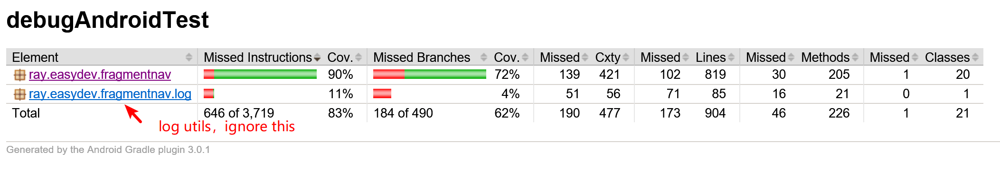

# FragmentNav - Start and manage fragment simpler


FragmentNav可以让你像启动activity一样方便启动的fragment，基于Task的管理方式让你可以方便的按需求来一次性启动/结束多个fragment。


## 功能

- 基于Task的管理方式
- 支持批量启动/结束fragments
- 支持BringToFront操作
- 自动保存在Activity.onSaveInstanceState之后执行的commit操作以及当App还原时自动执行相应操作
- 支持startFragmentForResult操作


## 准备

1、添加依赖

```groovy
compile 'ray.easydev.fragmentnav:fragmentnav:0.1.2'
```


2、创建一个Activity继承FnFragmentActivity或FnAppCompatActivity，以继承FnFragmentActivity为例:

##### MainActivity.java

```java
public class MainActivity extends FnFragmentActivity {
    static {
        //Configure the default fragment animations
        FragmentIntent.getDefault().setAnim(
          R.anim.page_start, //animation for start a fragment
          R.anim.page_finish, //animation for finish a fragment
          R.anim.page_show, //animation for show the previous fragment when finish a fragment
          R.anim.page_hide //animation for hide the fragment when start a new fragment
        );
    }

    @Override
    protected void onCreate(@Nullable Bundle savedInstanceState) {
        super.onCreate(savedInstanceState);
        setContentView(R.layout.activity_main);
    }

    @Override
    public int getFragmentContainerId() {
      	//The id of ViewGroup that contains fragments
        return R.id.fragment_container;
    }

    @NonNull
    @Override
    public FragmentIntent[] getStartIntents() {
      	//Configure the enter fragments
        return new FragmentIntent[]{
                new FragmentIntent(FmEnter.class)
                  //Disable the start animation to avoid the conflict with the activity's start animation
                  .addFlag(FragmentIntent.FLAG_NO_START_ANIMATION)
        };
    }
}
```

#### activity_main.xml

```xml
<?xml version="1.0" encoding="utf-8"?>
<FrameLayout xmlns:android="http://schemas.android.com/apk/res/android"
             android:id="@+id/fragment_container"
             android:layout_width="match_parent"
             android:layout_height="match_parent"/>

```

或者，你可以实现你自己的Activity，例如：

```java
public class MyActivity extends FragmentActivity implements FnActivity {
    private FragmentNav mFragmentNav;

    @Override
    protected void onCreate(@Nullable Bundle savedInstanceState) {
        //FragmentNav must be created before super.onCreate
        mFragmentNav = FragmentNavHelper.createBeforeSuperOnCreate(this, R.id.fragment_container, savedInstanceState);

        super.onCreate(savedInstanceState);
        setContentView(R.layout.activity_main);

        if(savedInstanceState == null){
            //If this app is not in recovery, start a new fragment
            mFragmentNav.startFragment(null, new FragmentIntent(FmEnter.class)
                    .addFlag(FragmentIntent.FLAG_NO_START_ANIMATION));
        }
    }

    @NonNull
    @Override
    public FragmentNav getFragmentNav() {
        return mFragmentNav;
    }

    @Override
    public void onBackPressed() {
        //Pass back pressed event to FragmentNav
        FragmentNavHelper.onBackPressed(getFragmentNav());
    }
}
```


3、继承FnFragment实现自己的Fragment

```java
class FmEnter extends FnFragment {
  
}
```

**开始愉快的使用FragmentNav吧😀**


## 用法

### 启动一个fragment

```java
 //Create a fragment intent with a string extra
 FragmentIntent fragmentIntent = new FragmentIntent(Fm01.class).
                     putExtra(KEY_STRING, "StringExtra");
      //Start the fragment
      startFragment(fragmentIntent);
 
```


### 结束单个fragment

```java
//类似结束activity，调用finish方法即可结束当前fragment
finish();
```


### 批量启动fragment

```java
//Create a intent to start fragment11 in new task
FragmentIntent intent11 = new FragmentIntent(Fm11.class)
  	.addFlag(FragmentIntent.FLAG_NEW_TASK);
//This fragment will be started in the same task with fragment11
FragmentIntent intent12 = new FragmentIntent(Fm12.class);

//This intent describe fragment21 will be started in another new task
FragmentIntent intent21 = new FragmentIntent(Fm21.class)
     .addFlag(FragmentIntent.FLAG_NEW_TASK);

//Start fragments, only fragment21's start animation will be played
startFragment(intent11, intent12, intent21);
```


###结束fragment task

```java
//Finish the task current fragment belongs
finishTask();

//Finish the tasks by task id. You can get task id by FragmentNav.taskIds() or FragmentNav.getTaskId()
getFragmentNav().finishTasks(0, 1, 2)
```


### BringToFront

```java
//Bring fragment02 to front if it exists in tasks, else start a new one
startFragment(new FragmentIntent(Fm02.class).addFlag(FragmentIntent.FLAG_BRING_TO_FRONT));
```


## 单元测试

目前已经对主要实现逻辑进行了单元测试，结果如下，没有测试到的主要是一些Exception处理分支和一些暂未开放的功能，后续会尽量补上。



兼容性测试结果如下:

| Android Sdk Version           | Android Support Version |
| ----------------------------- | ----------------------- |
| 4.2.2, 4.4.4, 5.1, 6.0.1, 7.0 | 24.2.1, 25.3.0, 26.1.0  |


## Todo

- Activity.onSaveInstanceState后commit的操作持久化到本地以支持App还原时执行

- 支持NO_HISTORY方式启动

- More (you tell me😀)...

  ​


## Versions
##### Version 0.1.2 `18012601`
- Add FnFragment.getTaskId() method
- Add FragmentNav.findFragment(Class<? extends FnFragment> cls, int directionFlags) method
- Improve unit test and sample app

##### Version 0.1.1 `18011801`
- startFragmentForResult support start multiple fragments at once

##### Version 0.1.0 `17121901`
- first working prototype

